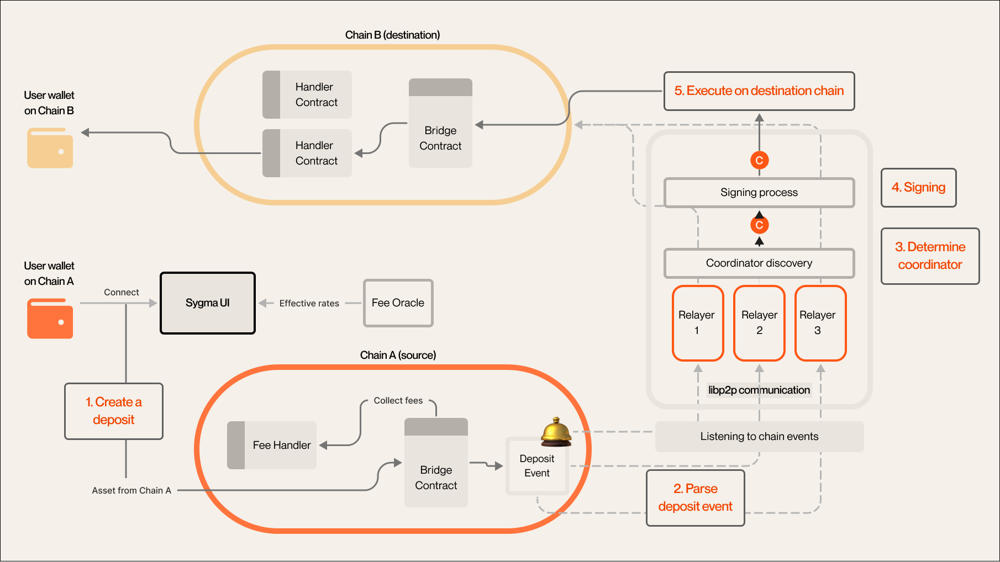

<div align="center">
    <h1>Sygma SDK </h1>
</div>
<br>
<p align="center">
  <a href="https://github.com/sygmaprotocol/sygma-sdk/actions/workflows/ci.yaml">
    
  </a>
    
  <a href="https://www.npmjs.com/package/@buildwithsygma/sygma-sdk-core">
  <a href="https://discord.gg/ykXsJKfhgq">
    
  </a>
    
  </a>
</p>
<p align="center">
  <a href="https://docs.buildwithsygma.com/">Sygma general documentation</a>
  |
  <a href="https://sygmaprotocol.github.io/sygma-sdk/">SygmaSDK typedocs</a>
</p>

A Typescript SDK allowing users to easily add cross-chain capabilities such as bridging tokens and sending messages to their dApp projects.
## Features
A few of the things you can do with Sygma SDK:
- Trasnfer assets between **Substrate** and **EVM** chains
- Transfer ERC20 and ERC721 tokens between EVM chains
- Send messages between EVM chains

## Overview of Sygma bridge architecture
The Sygma messaging protocol is able to transfer arbitrary data. This allows us to transfer not only ERC20 tokens but also ERC721 (eg, NFTs) in additional to something else we refer to as: Generic data. Generic data could be used to bridge governance proposals or voting actions, for example, or any other contract call by transferring calldata.
<p align="center">
  
  <em>Sygma Bridging Flow Diagram</em>
</p>

More information about the Sygma bridge architecture can be found in the [Sygma bridge documentation](https://docs.buildwithsygma.com/architecture).

## EVM example
```typescript
import { ethers } from 'ethers'
import {
  ERC20__factory,
  Bridge__factory,
} from "@buildwithsygma/sygma-contracts"
import { erc20Transfer } from '@buildwithsygma/sygma-sdk-core/EVM'
// Prepare instances of evm contracts and ethers provider
const provider = new ethers.providers.Web3Provider(window.ethereum)
const tokenInstance = ERC20__factory.connect('0x1234567890123456789012345678901234567890', provider)
const bridgeInstance = Bridge__factory.connect('0x1234567890123456789012345678901234567890', provider)
// Prepare params
const params = {
  amountOrId: '100',
  recipientAddress: '0x1234567890123456789012345678901234567890',
  tokenInstance, // ERC20 instance
  bridgeInstance, // Bridge instance from the sygma-contracts
  handlerAddress: '0x0987654321098765432109876543210987654321',
  domainId: '1',
  resourceId: '0x000000000000000001',
  feeData: { ... }, // fee data
  provider,
  overrides: { gasLimit: 1000000 } // optional
}
const transaction = await erc20Transfer(params)
// wait for the transaction to be mined
const receipt = await transaction.wait(3)
// get the deposit event
const depositEvent = getDepositEvent(receipt)
// Log the deposit nonce (unique identifier for the transfer)
console.log("depositNonce", depositEvent.args.depositNonce)
```

## Substrate example
```typescript
import { web3FromAddress } from "@polkadot/extension-dapp"
import { deposit } from '@buildwithsygma/sygma-sdk-core/Substrate'
// Prepare signer for the transaction
const injector = await web3FromAddress(currentAccount.address);
// const api;  ApiPromise instance
// const asset; MiltiAsset instance
console.log(asset)
// output:
// {
//   concrete: {
//     parents: 1,
//     interior: {
//       x3: [
//         { parachain: 2004 },
//         { generalKey: "0x7379676d61" }, // sygma
//         { generalKey: "0x75736463" }, // usdc
//       ],
//     },
//   },
// }
const unsub = await deposit(api, asset, amount, domainId, address)
  .signAndSend(currentAccount.address, { signer: injector.signer }, result => {
     handleTxExtrinsicResult(api, result, unsub, {
      onDepositEvent: (depositData) => {
        // Log the deposit nonce (unique identifier for the transfer)
        console.log("depositNonce", depositData.depositNonce)
      },
     });
   });
```
## React app examples

We have prepared a few examples of how to use the SDK in a React app. You can find them in the [examples](./examples) folder.

- ✅ [evm-to-substrate-react-example](./examples/evm-to-substrate-react-example) - Example of bridging ERC20 tokens from EVM to Substrate
- ✅ [substrate-to-evm-react-example](./examples/substrate-to-evm-react-example) - Example of bridging asset from Substrate to EVM
## Getting started
### Prerequisites
- Node.js >= 16.0.0 for server-side usage
- ethers.js >= 5.0.0 for EVM usage
- @polkadot/api >= 4.0.0 for Substrate usage
- @polkadot/extension-dapp >= 0.1.0 for DApp usage

### Addresses of deployed bridges

The sygma bridge is deployed on the following test networks.
EVM:
- Goerli
- Polygon mumbai
- Moonbase alpha
- Sepolia

Substrate:
- Rococo

There is two streams of deployment for the sygma bridge:
- Develop (Most latest version of the bridge). You can get json with the addresses from [>>HERE<<](https://config.develop.buildwithsygma.com/config)
- Testnet (Stabel version of the bridge). You can get json with the addresses from [>>HERE<<](https://config-server.test.buildwithsygma.com/config)
### Installation
```bash
# yarn
yarn add @buildwithsygma/sygma-sdk-core
# or npm
npm install @buildwithsygma/sygma-sdk-core
```

You also need to install ethers.js ans sygmabridge contracts
```bash
yarn add ethers @buildwithsygma/sygma-contracts
```

For substrate usage you need to install polkadotjs packages
```bash
yarn add @polkadot/api @polkadot/extension-dapp @polkadot/util-crypto
```

## Usage

### EVM
#### ERC20 and ERC721 approvals

First you need to ensure that erc20 is approved for the erc20 hadler and fee handler contract. You can do it on youre own or use our function for it.
```typescript
import { ERC20__factory } from '@buildwithsygma/sygma-contracts'
import { approve } from '@buildwithsygma/sygma-sdk-core/EVM'
const erc20Instance = ERC20__factory.connect("0x1234567890123456789012345678901234567890", signer) // ethers signer
// getting gas price
const gasPrice = await isEIP1559MaxFeePerGas(
  signer.provider as providers.Web3Provider
);
const receipt = await approve(
  "100", // amount
  erc20Instance, // erc20 instance
  "0x0987654321098765432109876543210987654321", // erc20 handler address
  1, // number of confirations
  {
    gasPrice, // gas price
  }
);
// same should be for fee handler if you collect fee as erc20 token
// we will look at it in the next step
```
#### Fee calculation
The next step is to calculate fee data:

```typescript
// import function depending on your fee strategy
import { calculateBasicfee } from '@buildwithsygma/sygma-sdk-core/EVM'

const feeData = await calculateBasicfee({
  basicFeeHandlerAddress: '0x1234...',
  provider: new ethers.providers.JsonRpcProvider('https://mainnet.infura.io/v3/YOUR-PROJECT-ID'),
  sender: '0x5678...',
  fromDomainID: '1',
  toDomainID: '2',
  resourceID: '0x00000...0001',
  tokenAmount: '100',
  recipientAddress: '0xdef0...',
});
console.log(feeData);
```
#### Deposit
Send deposit transaction using bridge contract:
```typescript
// You can find detailed example above or in the examples folder
const provider = new ethers.providers.Web3Provider(window.ethereum)
const tokenInstance = ERC20__factory.connect('0x1234567890123456789012345678901234567890', provider)
const bridgeInstance = Bridge__factory.connect('0x1234567890123456789012345678901234567890', provider)
// Prepare params
const params = {
  amountOrId: '100',
  recipientAddress: '0x1234567890123456789012345678901234567890',
  tokenInstance, // ERC20 instance
  bridgeInstance, // Bridge instance from the sygma-contracts
  handlerAddress: '0x0987654321098765432109876543210987654321',
  domainId: '1',
  resourceId: '0x000000000000000001',
  feeData: { ... }, // fee data
  provider,
  overrides: { gasLimit: 1000000 } // optional
}
const transaction = await erc20Transfer(params)
// wait for the transaction to be mined
const receipt = await transaction.wait(3)
// get the deposit event
const depositEvent = getDepositEvent(receipt)
// Log the deposit nonce (unique identifier for the transfer)
console.log("depositNonce", depositEvent.args.depositNonce)
```
#### EVM network as destination
Using deposit nonce you can listen for proposal execution event on the destination chain to track the status of the transfer:

```typescript
const depositNonce = 42 // get your depositNonce from deposit event
const bridgeInstance = Bridge__factory.connect(...) // your bridge contract instance from sygma-contracts
createProposalExecutionEventListener(
 depositNonce,
 bridgeInstance,
 (originDomainId, depositNonce, dataHash, tx) => {
   console.log(
     "execution events callback",
     originDomainId,
     depositNonce,
     dataHash,
     tx
   );
 }
);
```
All set of functions and types for EVM you can find in our [typedocs](https://sygmaprotocol.github.io/sygma-sdk/modules/EVM.html)
### Substrate
#### Deposit
You can call the deposit function from the substrate pallet.
You don't need separately calculate the fees or send approval transaction before the deposit.
```typescript
// more code in example above
const unsub = await deposit(api, asset, amount, domainId, address)
  .signAndSend(currentAccount.address, { signer: injector.signer }, result => {
     handleTxExtrinsicResult(api, result, unsub, {
      onDepositEvent: (depositData) => {
        // Log the deposit nonce (unique identifier for the transfer)
        console.log("depositNonce", depositData.depositNonce)
      },
     });
   });
```
#### Substrate network as destination
Using deposit nonce you can listen for proposal execution event on substrate side in case of transfering from EVM network:

```typescript
import { listenForEvent } from '@buildwithsygma/sygma-sdk-core/Substrate'
// Assuming you have a valid ApiPromise instance (api)
// and a callback function (callback)
await listenForEvent(api, "ProposalExecution", (data) => {
  console.log("ProposalExecution", data);
  const dataEvent = data as {
    depositNonce: string;
    dataHash: string;
   };
   console.log("ProposalExecution event is emmited. Transfer is finished")
   console.log(dataEvent)
});
```
All set of functions and types for Substrate you can find in our [typedocs](https://sygmaprotocol.github.io/sygma-sdk/modules/Substrate.html)
## Appendix
### Local setup using docker
Local setup is a docker configuration to run EVM and Substrate nodes as well as relayers on the local dev machine.
Make sure that you have latest installation of Docker and docker-compose.
Clone the repository of sygma-relayer and go to repository's directory.
```bash
git clone git@github.com:sygmaprotocol/sygma-relayer.git
cd sygma-relayer
```

You can build and run the local setup in a __quick way__ by running the following command:

```bash
# assuming that you are in the root directory of sygma-relayer
# it will build and start relayers: `docker-compose --file=./example/docker-compose.yml up --build`
make example
````
__Or__ you can build and run the local setup __manually__ by running the following commands:

```bash
# assuming that you are in the root directory of sygma-relayer
cd ./example
# Build the fresh docker images for relayers:
docker-compose build
# Finally we can start our nodes and relayers:
docker-compose up -d
````

## Support
<a href="https://discord.gg/ykXsJKfhgq">
  
</a>

## License
GNU Lesser General Public License v3.0


