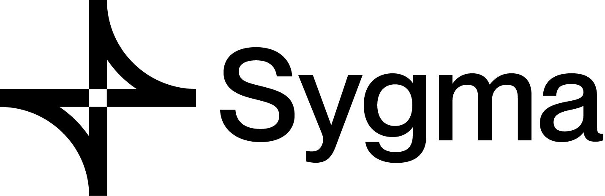
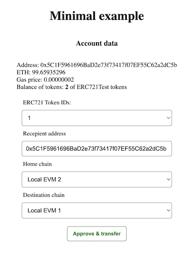
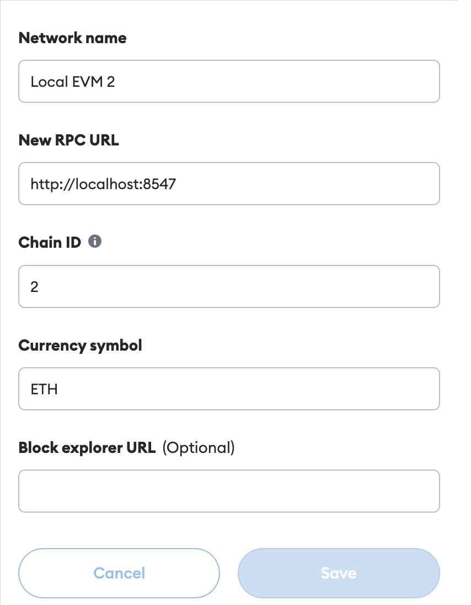
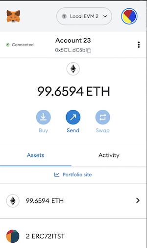

<p align="center"><a href="https://https://chainsafe.io/"></a></p>

## Sygma SDK ERC721 React Example
<p align="center">

</p>

This simple React application demonstrate the usage of our SDK methods, alongside with the [Sygma](https://github.com/sygmaprotocol/sygma-relayer) local setup.

### Getting started
#### Installing and building sdk
Before running the erc721 example you need to clone the repo and then install dependencies:

```bash
git clone git@github.com:sygmaprotocol/sygma-sdk.git
cd sygma-sdk
yarn
```

then compile sdk with following command:
```bash
# from the repository root
cd ./packages/sdk
yarn tsc
```


#### Local setup
To run our local setup please follow insturctions in [sygma-relayer repo](https://github.com/sygmaprotocol/sygma-relayer#local-environment)

In the end you should have 2 geth nodes running on `localhost:8545` and `localhost:8547` and two relayers running

### Running the react app
first change directory to erc721 directory:

```bash
# from the repository root
cd examples/erc721-react-example
```

Mint 2 ERC721 token for test:
```bash
# from examples/erc721-react-example
yarn mintNft
```
Please add private key `0xcc2c32b154490f09f70c1c8d4b997238448d649e0777495863db231c4ced3616`
and erc721 token `0x8dA96a8C2b2d3e5ae7e668d0C94393aa8D5D3B94` to metamask
<p align="center">



</p>


run the command to start the app:
```bash
# from examples/erc721-react-example
yarn start
```
and then you can open your browser on http://localhost:3001


